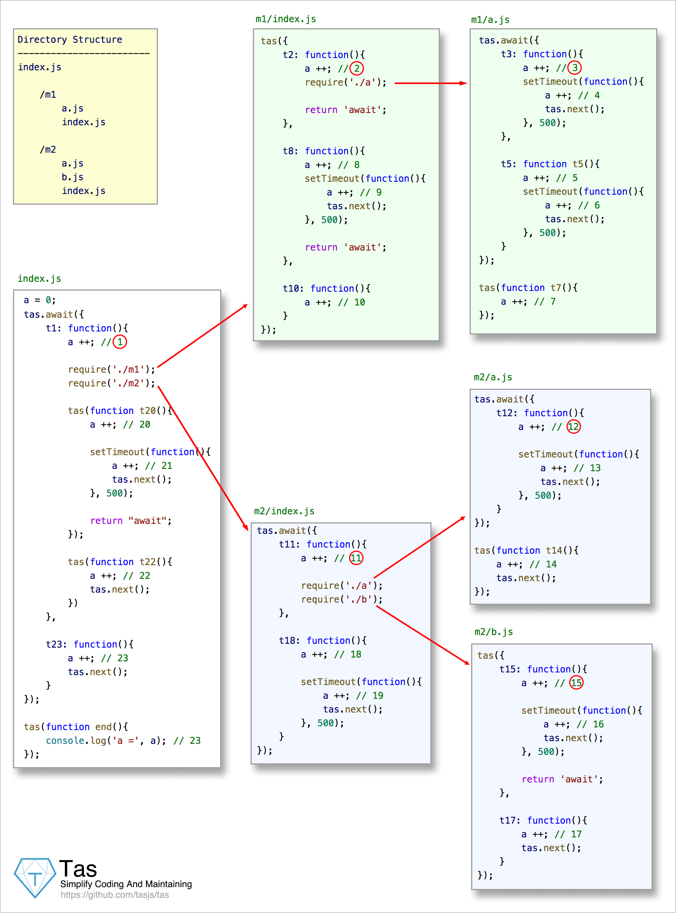
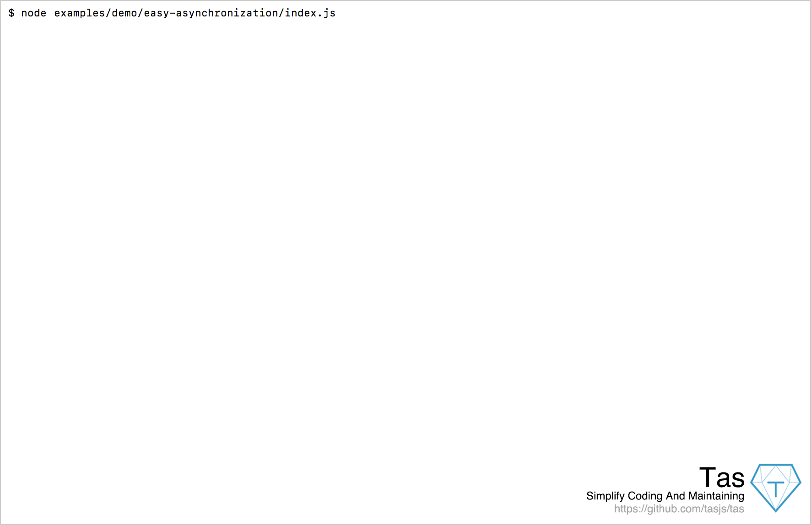
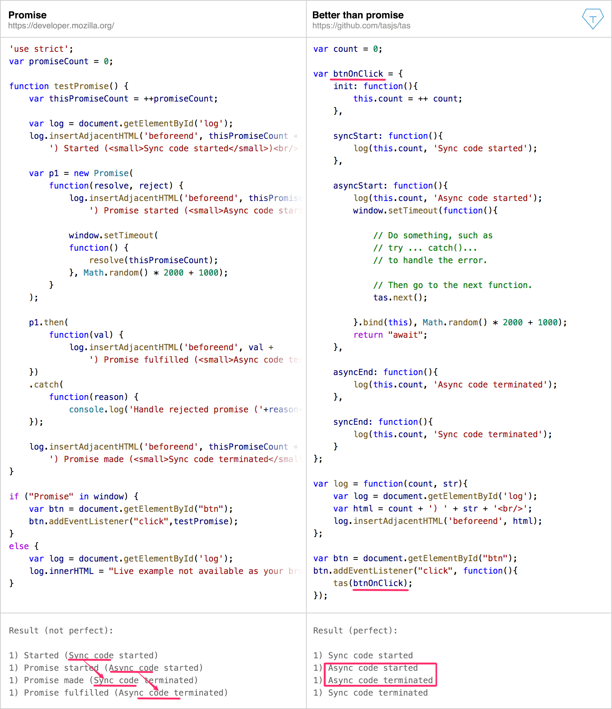
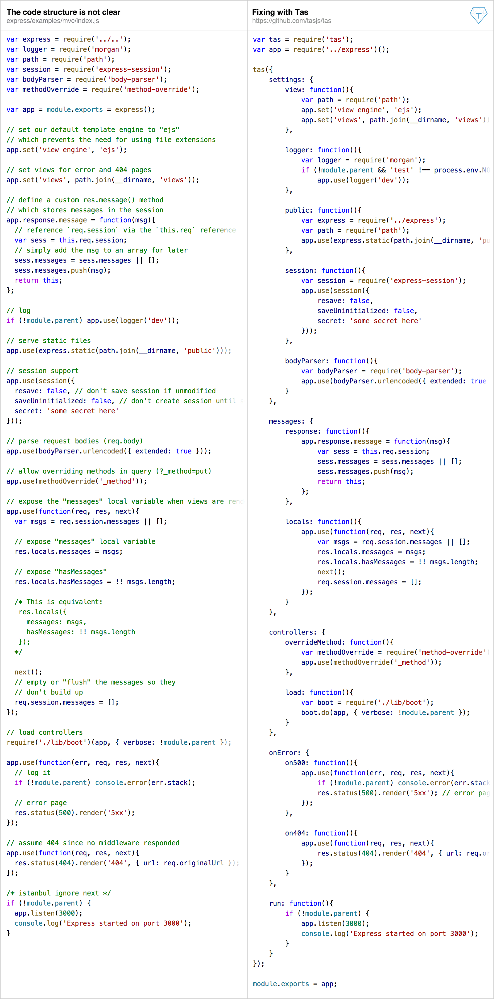

<p align='center'><a href='https://github.com/tasjs/tas' target='_blank'></a><br />

</p>

<p align='center'>
<a href='https://travis-ci.org/tasjs/tas' target='_blank'></a>
<a href='https://ci.appveyor.com/project/tasjs/tas' target='_blank'></a>
<a href='https://codecov.io/gh/tasjs/tas' target='_blank'></a>
<a href='https://npmjs.org/package/tas' target='_blank'></a>
<a href='https://npmjs.org/package/tas' target='_blank'></a>
</p>

　

Make code clear, easy to test and maintain. With Tas, we can write a set of micro tasks instead of a complex function or module, and the async tasks are performed like sync tasks.  Tas can be used in [Node.js](https://nodejs.org) and in browsers. "Tas" is the abbreviation of "tasks".

In Tas, we can insert or remove an async tasks anywhere in any micro task without having to adjust the code elsewhere, all tasks are executed in the order we write, just like the sync tasks, and more better than Promise and generator / yield and async / await, and the tasks [execution order](./doc/execution-order/execution-order.md) is more reasonable.

Tas can performs more than **3 million** sync tasks or **1 million** async tasks per second, faster than native Promise. With Tas, we can write server code with clear structure and excellent performance in Node.js. [Benchmark of Performance](./doc/performance/performance.md)

　

## Install

In Node.js:
```bash
$ npm install tas --save
```

　

In Web:

Download [tas.js](./dist/tas.js) or [tas.min.js](./dist/tas.min.js) (only 3KB gzipped).

　

## Test

Clone the Tas repo first:

```bash
$ git clone https://github.com/tasjs/tas.git
$ cd tas
$ npm install
```

Then run the tests in Node.js:
```bash
$ npm test
```

Or run the tests in your browser:
```bash
$ open test/web/index.html
```

　

## Demo

To run these demos, please clone the Tas repo (if you have not done it yet, see details in section "Test"). Then see the **examples/demo** folder. 

　

### Easy Asynchronization

In this demo, there are many asynchronous tasks (represented by setTimeout()) in multiple modules, which are executed in the order we write, just like the synchronization tasks. See below.



The results are as follows:



Run this demo in Node.js:

```bash
$ cd /path/to/tas
$ node examples/demo/easy-asynchronization/index.js
```

　

### Fixing Callback Hell


Run these demos in Node.js:

```bash
$ cd /path/to/tas
$ cd examples/demo/fixing-callback-hell
$ node callback-hell.js
$ node fixing-callback-hell.js
```

　

### Better Than Promise



Run these demos in your browser:

```bash
$ cd /path/to/tas
$ cd examples/demo/better-than-promise
$ open promise.html
$ open tas.html
```

　

### Clear Code Structure



See details: [Express examples by Tas](https://github.com/tasjs/express-examples-by-tas)

　

## Quick Examples

### Sync Tasks

With Tas, we can turn complex logic or high-coupling logic into a set of mini-tasks. All mini-tasks are executed one by one. 

```js
tas({
    t1: function () {
        return 1;
    },
    t2: function(a){
        console.log(a); // 1
        return [2, 3];
    }
});

tas({
    t3: {
        t4: function (a, b) {
            console.log(a, b); // 2 3
            return [[4, 5, 6]];
        }
    },
    t5: {
        t6: function (arr) {
            console.log(arr); // 4 5 6
        }
    }
});
```

　

### Async Tasks

In Tas, we can insert or remove an async tasks anywhere in any micro task without having to adjust the code elsewhere, all tasks are executed in the order we write, just like the sync tasks.

```js
var a = 0;

tas.await(function(){
    a ++; // 1
  
    setTimeout(function(){      
        a ++; // 2
        tas.next();
    }, 1000);
});

tas(function(){
    a ++ ; // 3
    console.log(a); // 3
})
```

　

### As Promise

We can use tas as Promise. Tas is more better than Promise and generator / yield and async / await, and the tasks [execution order](./doc/execution-order/execution-order.md) is more reasonable. Tas can performs more than **1 million** async tasks per second, faster than native Promise. [Benchmark of Performance](./doc/performance/performance.md)

```js
tas.promise(function(){
    process.nextTick(function(){
        tas.resolve(1); // or tas.resolve(null, data)
    });
});

tas(function (data) { // or function(err, data)
   console.log(data);
});
```

　

## Full Examples

See the **examples/usage** folder. All examples (with tests) are categorized according to Node.js, Web and Web-RequireJS.

　

## API

### Sync Tasks

| API             | Functions                   | Usage                                    |
| --------------- | --------------------------- | ---------------------------------------- |
| return \<data\> | Pass data to the next task. | [Usage](./examples/usage/nodejs/1.sync_tasks/return_data.js) |

　

### Async Tasks

| API                | Functions                                | Usage                                    |
| ------------------ | ---------------------------------------- | ---------------------------------------- |
| return "await"     | Hang up Tas, waiting for the async task execution is completed. | [Usage](./examples/usage/nodejs/2.async_tasks/async_tasks.js) |
| tas.await()        | Sequential perform a set of async tasks. | [Usage](./examples/usage/nodejs/2.async_tasks/async_tasks.js) |
| tas.next(\<data\>) | When async task is done, pass data to the next task. | [Usage](./examples/usage/nodejs/2.async_tasks/pass_data_via_tas.next.js) |

　

### As Promise

| API                  | Functions                                | Usage                                    |
| -------------------- | ---------------------------------------- | ---------------------------------------- |
| tas.promise()        | Equivalent to tas.await().               | [Usage](./examples/usage/nodejs/3.as_promise/tas.promise_is_easier_to_use_than_promise.js) |
| tas.resolve()        | Equivalent to tas.next().                | [Usage](./examples/usage/nodejs/3.as_promise/tas.promise_is_easier_to_use_than_promise.js) |
| tas.all()            | After all async tasks are completed, continue. | [Usage](./examples/usage/nodejs/3.as_promise/use_tas.all_as_promise.all.js) |
| tas.race()           | As long as one of async tasks is completed, continue. | [Usage](./examples/usage/nodejs/3.as_promise/use_tas.race_as_promise.race.js) |
| tas.cancel()         | When tas.race() is done, cancel the unfinished async task(s). | [Usage](./examples/usage/nodejs/3.as_promise/use_tas.cancel_to_cancel_the_unfinished_tasks.js) |
| this.done(err, data) | When tas.all() or tas.race() is done, pass data to the next task. | [Usage](./examples/usage/nodejs/3.as_promise/use_tas.all_as_promise.all.js) |

　

### ForEach Tasks

| API                   | Functions                                | Usage                                    |
| --------------------- | ---------------------------------------- | ---------------------------------------- |
| tas.forEach()         | Perform a set of tasks for each array element. | [Usage](./examples/usage/nodejs/4.forEach_tasks/Perform_a_set_of_tasks_for_each_array_element.js) |
| return "continue"     | Go to the next loop.                     | [Usage](./examples/usage/nodejs/4.forEach_tasks/return_continue.js) |
| tas.continue()        | Go to the next loop (in closures).       | [Usage](./examples/usage/nodejs/4.forEach_tasks/tas.continue.js) |
| return "breakForEach" | Break the tas.forEach() and Go to the next task. | [Usage](./examples/usage/nodejs/4.forEach_tasks/return_breakForEach.js) |
| tas.breakForEach()    | Break the tas.forEach() and Go to the next task (in closures). | [Usage](./examples/usage/nodejs/4.forEach_tasks/tas.breakForEach.js) |

　

### Break The Flow

| API            | Functions                                | Usage                                    |
| -------------- | ---------------------------------------- | ---------------------------------------- |
| tas.begin()    | Use it before all tasks if you wanna [abort in Tas](./doc/execution-order/concurrency-order.md). | [Usage](./examples/usage/nodejs/5.break_the_flow/return_abort.js) |
| tas.abort()    | Abort the current [tasks stream](./doc/concurrency-order/concurrency-order.md) from nested function (closures). | [Usage](./examples/usage/nodejs/5.break_the_flow/tas.abort.js) |
| return "abort" | Abort the current [tasks stream](./doc/concurrency-order/concurrency-order.md) in task. | [Usage](./examples/usage/nodejs/5.break_the_flow/return_abort.js) |
| this.abort()   | Abort the current [tasks stream](./doc/concurrency-order/concurrency-order.md) in tas.all() or tas.race(). | [Usage](./examples/usage/nodejs/5.break_the_flow/this.abort.js) |
| return "break" | Break the current tasks.                 | [Usage](./examples/usage/nodejs/5.break_the_flow/return_break.js) |
| tas.break()    | Break the current tasks from nested function (closures). | [Usage](./examples/usage/nodejs/5.break_the_flow/tas.break.js) |

　

## Log Tree

Tas can prints the task name with indent, and the logs in tasks is printed with the indent of tasks, so a tree structure is formed, like the gif presentation in above section "Easy Asynchronization". This makes the execution of the entire project very clear, more intuitive than the function stack in the debugger. [How To Use](./doc/log-tree/log-tree.md)

　

## Performance

Tas can performs more than **3 million** sync tasks or **1 million** async tasks per second, faster than native Promise. With Tas, we can write server code with clear structure and excellent performance in Node.js. [Benchmark of Performance](./doc/performance/performance.md)

　

## License

[MIT](LICENSE)

Copyright (c) 2017, Owen Luke
